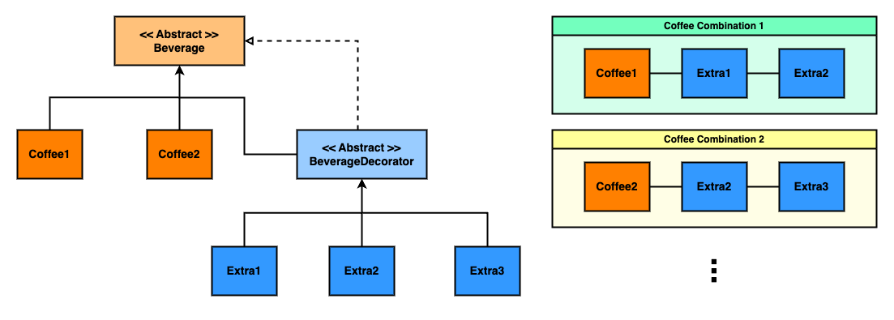
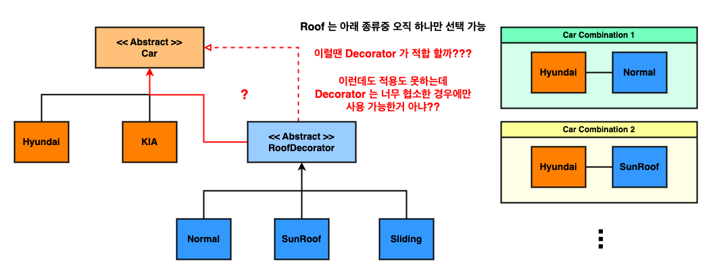

# Chapter 03 - 객체 꾸미기 : 데코레이터 패턴

## Summary

이번 챕터는 `Decorator` 패턴을 설명한다.

그런데 개인적으로 `이 패턴이 그렇게 유용한가?` 는 잘 모르겠다.

`Decorator` 패턴이 `GUI` 구성, `텍스트 포맷팅` 등 어떤 상황에서는 유용한 것에는 동의한다.
하지만 `그 상황들` 이 너무 협소한 것은 아닌지 의심된다.

즉, `Decorator` 패턴이 특정 상황에서**만** 유용하지, 굳이 `디자인 패턴` 에 넣어 설명할 정도로 광범위하게 유용한지는 모르겠다는 것이다.

예를 들어 생각해보자. 아래 예시는 교재에서 보여준 `커피 예제` 와 동일하다.

<!-- decorator-counter-1.png -->

<p align="center">
    
</p>

`Decorator` 패턴을 이용하면 위 그림처럼 **"`Coffee` 에 원하는 만큼 `Extra` 를 붙일 수 있는 점"** 에는 동의한다. 교재가 설명한
듯이 `Coffee-Extra` 의 조합마다 독립적인 `class` 를 만든다면 혼돈 그 자체일 것이다.

하지만 여기서 내가 말하고 싶은 점은, `"굳이 Decorator 패턴을 이용 안하더라도 저렇게 만들 수 있지 않느냐"` 는 것이다.

```java
interface CoffeeExtra {

    double cost();
}

abstract class Coffee {

    final double price;
    final List<CoffeeExtra> extras = new ArrayList<>();

    public Coffee(double price) {
        this.price = price;
    }

    public void addExtra(CoffeeExtra extra) {
        extras.add(extra);
    }

    public double getTotalPrice() {
        return price + extras.stream().mapToDouble(CoffeeExtra::cost).sum();
    }
}

class Coffee1 extends Coffee {

    public Coffee1() {
        super(5.5d);
    }
}

class Extra1 implements CoffeeExtra {

    @Override
    public double cost() {
        return 0.5d;
    }
}
```

```java
Coffee coffee = new Coffee1();

if (userInput contains extra1) {
    coffee.addExtra(new Extra1());
}
if (userInput contains extra2){
    coffee.addExtra(new Extra2());
}
    ...
```

확실히 `GUI 구성`, `텍스트 포맷팅` 처럼 파생 클래스가 압도적으로 많이 생겨 관리하기 복잡할 경우 `Decorator` 패턴이 유용할 것이라 생각된다.

하지만 우리가 개발하며 마주할 정도의 상황에서 `Decorator` 를 사용하는건 오히려 코드 복잡도만 높이는게 아니냐는 것이다.

위에서 보인것 처럼 교재 정도의 예시는 간단히 `List` 만 사용해 완성할 수 있기 때문이다.

더군다나 위 예시는 `Extra1`, `Extra2` 등 한 `Coffee` 에 여러개의 `Extra` 가 붙을 수 있을때만 가능하다.

그럼 그렇지 않은 경우에는?

<!-- decorator-counter-2.png -->

<p align="center">
    
</p>

나로서는 위 예시를 `Decorator` 로 해결하는 건 오히려 복잡하고 더럽게 만든다고 느껴졌다. 그래서 `Decorator` 가 너무 특정 상황에서만 유용한 패턴이 아닌지
의심되었던 것이다.

물론 내가 생각하지 못한 부분이 분명히 존재할 것이다. 하지만 지금의 나로서 `Decorator` 를 이해하기에는 여기까지가 한계인 것 같아 다음으로 넘어가려고 한다.

> ### 디자인 원칙
>
> 1. 클래스는 확장에는 열려 있어야 하지만 변경에는 닫혀 있어야 한다. _(OCP)_

> ### 데코레이터 패턴 : _Decorator Pattern_
>
> 데코레이터 패턴으로 객체에 추가 요소를 동적으로 더할 수 있습니다.
> 데코레이터를 사용하면 서브클래스를 만들 때보다 훨씬 유연하게 기능을 확장할 수 있습니다.

---
